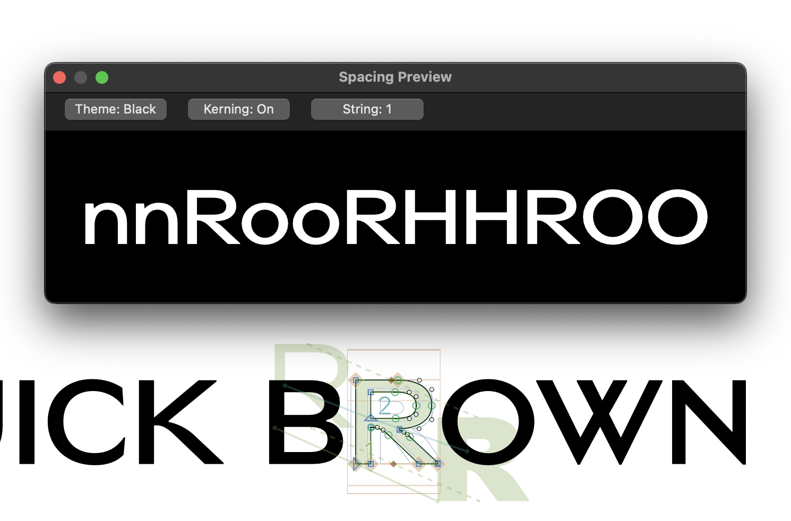

# Spacing Preview

A compact spacing and kerning preview plugin for **Glyphs 3 and Glyphs 4**.

Spacing Preview opens a small floating panel that shows the currently selected glyph inside useful spacing strings, so you can check sidebearings and kerning without leaving the Edit view.



## Features

- Live preview of the currently selected glyph
- Six spacing strings for lowercase and uppercase testing
- Stylistic sets and other suffix-based alternates follow the features active in the Edit view
- Kerning on/off toggle
- Dark and light low-contrast themes (dark by default)
- Quick switching between spacing strings
- Opens in the top-left corner of the Edit view
- Automatically follows the active Glyphs Edit view
- Hides when no Edit tab is active
- Compatible with Glyphs 3 and Glyphs 4

## Spacing strings

The selected glyph replaces `x` in these strings:

```text
nnxooxHHxOO
nnxnoxoo
HHxHOxOO
nnnxnnn
HHHxHHH
HHxHnxnn
```

## Stylistic sets

When a feature such as `ss01` is switched on in the Edit view, the spacing glyphs are replaced by their alternates using the usual Glyphs naming (`n` → `n.ss01`, with several sets `n.ss01.ss03`). This works for stylistic sets, `salt`, `cv01` and similar features whose alternates use suffix naming. Contextual substitutions defined only in feature code are not applied.

## Installation

1. Download the latest packaged release from the **Releases** section.
2. Unzip the downloaded file.
3. Double-click `SpacingPreview.glyphsPlugin`.
4. Confirm the installation in Glyphs if prompted.
5. Restart Glyphs.
6. Open the plugin from **Edit → Spacing Preview**.

> For installation, use the packaged release ZIP rather than GitHub's automatically generated “Source code” archives.

### Updating from 1.0

Install the new release the same way. Glyphs replaces the old version; restart Glyphs afterwards.

## Compatibility

- Glyphs 3
- Glyphs 4

## Version

Current release: **1.1.0** — see [CHANGELOG](CHANGELOG.md).

## License

Spacing Preview is open source and released under the **MIT License**. See [LICENSE](LICENSE).

## Author

**Ondřej Trégler / Pils Type**  
https://pilstype.com
